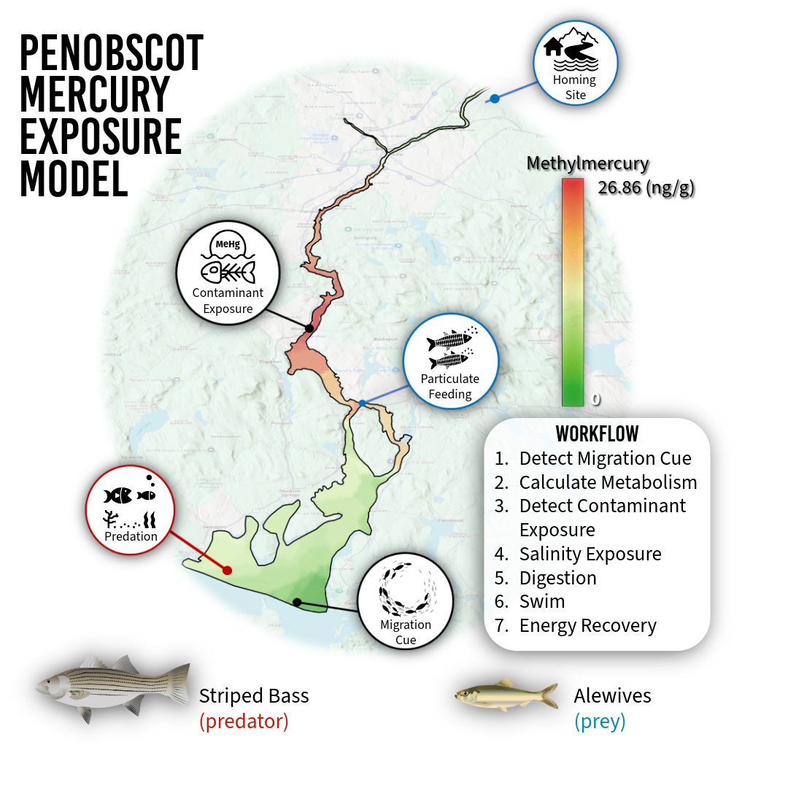

# Applied Model Building Tutorial: Penobscot Mercury Exposure Model (P-MEM)
```{r, include=FALSE}
current_chapter <- "18-integrate_functions_example_03.Rmd"
```
```{r, child="_download_button.Rmd"}
```

This chapter demonstrates how every submodel introduced in this library — schooling, landward and seaward migration, selective tidal stream transport, osmoregulation, metabolism, digestion, foraging, migration cue detection, and contaminant exposure — can be assembled into a single site-specific agent-based model. The Penobscot Mercury Exposure Model (P-MEM) is the applied implementation provided in [Quintana (2026)](https://doi.org/10.5281/ZENODO.19483469), and hosted [GitHub Version Repository](https://github.com/vmahan1998/Penobscot_Mercury_Exposure.git). Unlike the tutorial examples in Chapters 15 and 16, P-MEM is spatially and temporally explicit: agents navigate a 2-D GIS representation of the Penobscot River Estuary, forced by hourly hydrodynamic outputs from a validated Delft3D FM model, with a nested agent-based time step representing one 5-minute interval on a real calendar beginning in April 2023.

Results from the full model — spatial exposure maps, time-series outputs, and multi-scenario comparisons — are available in the interactive [Mercury Risk Explorer](https://vkzfr3-vanessa-mahan.shinyapps.io/Mercury_Risk_Explorer/).

## Module Integration

P-MEM couples hydrology, behavior, and physiology in a single model time step. Contaminant exposure in estuaries is spatially and temporally heterogeneous, structured by tidal forcing and seasonal discharge that simultaneously organize anadromous fish migration timing and the spatial distribution of methylmercury (MeHg) in the water column. Realized exposure risk — defined as the cumulative contaminant interaction accumulated by an individual over time — is not determined by spatial coincidence between contamination and habitat suitability alone, but by what the fish is doing, where it is, and what physiological state it is in at every time step.

The model simulates two focal species: alewives (*Alosa pseudoharengus*) as obligate spawning migrants, and striped bass (*Morone saxatilis*) as facultative seasonal predators. These species interact through predator–prey encounters that modify alewife movement (fleeing) and change which exposure pathways dominate. Predation pressure is varied across scenarios by scaling striped bass visual detection distance, which modifies encounter rates without changing population size.

**Temporal structure.** Each time step represents one 5-minute interval. The calendar advances minute → hour → day using the `calendar` procedure. Hydrodynamic patch variables (velocity, depth, salinity, temperature, SPM) are updated every 12 time steps (1 hour) from the empirical time-series loaded at setup, derrived from the outputs of a hydrodynamic model. Migration cue detection (`update-migration-cue`) runs once per day. All behavioral, physiological, and exposure submodels run every tick for active agents.

**Spatial scale.** The model domain is the Penobscot River Estuary, Maine, discretized as a 0–200 × 0–350 patch grid (3 m per patch, set with `resize-world 0 200 0 350`). Patches are classified as upper estuary, middle estuary, lower estuary, and sea using GIS shapefiles. The dam (Milford Dam) is located at y = 342 and serves as both a behavioral barrier and a validation cross-section. `home-patch` (upper estuary, `patch 199 346`) and `migration-patch` (sea entry, `patch 100 35`) are fixed.

**Coupling logic.**



The core tick sequence within `penobscot-go` is:

1.  Update patch data from hydrodynamic time series (`update-patch-data`)
2.  Reset `cost-to-home`, `cost-to-sea`, `cost-to-prey` routing fields
3.  Per-agent migration cue accumulation (`calc-migration-probability`)
4.  Per-agent behavioral sequence — `calculate-metabolism` → `swim` → `mercury-contamination` → `methylmercury-contamination` → `osmoregulate` → `digest` → `forage`
5.  Residence phase and departure logic (wait-days counter)
6.  Dam crossing and estuary entry/exit counters (`count-alewives`)
7.  Export results (`export-results`)

The `swim` procedure is the central integrator: it sets `previous-patch` / `previous-x` / `previous-y`, calls `calculate-cost-to-home` → `calculate-difficulty-landward` → `calculate-swimming-speed-landward` → `selective-tidal-stream-transport-landward` (which calls `migrate-landward`, which calls `school`), and then deducts `calculate-swim-energy`. All of this happens before contamination tracking, osmoregulation, or digestion, because movement determines which patch the agent is on when those exposure functions read patch-level contaminant values.

## Function Dependencies

The table below shows the full dependency chain for an alewife in the landward migration phase. Functions are listed in the order they must be called each tick.

| Function | Required Inputs | Output Variables | Dependent On |
|------------------|------------------|------------------|------------------|
| `calendar` | `ticks`, `minute`, `hour`, `day` | `minute`, `hour`, `day`, `month`, `night?` | tick counter |
| `update-patch-data` | `current-hour`, `velocity-series`, `salinity-series`, `temp-series`, `spm-series` | `velocity`, `salinity`, `temperature`, `SPM` (per patch) | `calendar` (hourly) |
| `update-migration-cue` | `day`, `cue-days` | `cue-active?`, `migration-trigger?` | `calendar` (daily) |
| `calc-migration-probability` | `migration-trigger?`, `migration-probability` | `migration-probability`, `start-migration?` | `update-migration-cue` |
| `calculate-metabolism` | `weight`, `temperature`, `age-num`, `met-base`, `optimal-temperature` | `metabolism-rate`, `swim-efficiency`, `osmoregulation-efficiency` | patch `temperature` |
| `calculate-cost-to-home` | `home-patch`, `patch-terrain`, `difficulty-factor` | `cost-to-home` (all water patches) | `swim-efficiency` |
| `calculate-difficulty-landward` | `velocity`, `weight`, `max-seaward-velocity`, `max-landward-velocity` | `difficulty-factor` | patch `velocity` |
| `calculate-swimming-speed-landward` | `energy`, `difficulty-factor`, `max-speed`, `min-speed`, `velocity`, `prev-speed`, `swim-efficiency` | `speed`, `prev-speed` | `calculate-difficulty-landward` |
| `selective-tidal-stream-transport-landward` | `velocity`, `speed`, `min-speed`, `swim-efficiency`, `selective-tidal-transport?`, `STST-start-tick` | `xcor`, `ycor`, `selective-tidal-transport?`, `tidal-transport-in-patch` | `calculate-swimming-speed-landward` |
| `migrate-landward` *(inside STST Case 3)* | `speed`, `home-patch`, `cost-to-home`, schooling coefficients | `xcor`, `ycor`, `trail`, `heading`, patch visit counters | `calculate-cost-to-home`, schooling state |
| `calculate-swim-energy` | `difficulty-factor`, `swim-efficiency`, `swim-base` | `E-swim`, `energy` | after movement |
| `mercury-contamination` | `mercury`, `SPM`, `metabolism-rate`, `ionregulatory-stress`, `min-Hg`, `max-Hg` | `hg-uptake-risk`, `hg-exposure-total`, `hg-exposure-duration` | `swim`, patch position |
| `methylmercury-contamination` | `methylmercury`, `SPM`, `metabolism-rate`, `ionregulatory-stress`, `min-MeHg`, `max-MeHg` | `mehg-uptake-risk`, `mehg-exposure-total`, `mehg-exposure-duration` | `swim`, patch position |
| `osmoregulate` | `salinity`, `acclimated-salinity`, `chloride-cell-density`, `E-base`, `E-creation` | `ionregulatory-stress`, `chloride-cell-density`, `E-osmo`, `energy` | patch `salinity`, `metabolism-rate` |
| `digest` | `stomach-contents`, `digestion-rate`, `digestion-efficiency` | `stomach-contents`, `energy`, `weight`, `mehg-foraging-total` | `forage` (prior tick) |
| `forage` | `energy`, `landward-migration?`, `weight`, `original-weight`, `salinity`, `SPM` | `foraging?`, `lipid-loss?`, `filter-feed?`, `energy`, `weight`, `stomach-contents` | `swim`, `osmoregulate` |
| `count-alewives` | `previous-patch`, `patch-here`, `patchtype` | daily totals (dam crossings, estuary entry/exit) | end of tick |
| `export-results` | all agent and patch state variables | CSV output files | end of tick |

**Key dependency on `swim`:** All contamination, osmoregulation, and digestion functions read patch-level variables (`mercury`, `methylmercury`, `salinity`, `temperature`, `SPM`) from `patch-here`. This means `swim` — which moves the agent — must complete before any of these functions run. If the order is reversed, agents are exposed to the contaminant levels of the *previous* tick's patch, not their current location.

**STST and schooling coupling:** `selective-tidal-stream-transport-landward` gates the call to `migrate-landward`. `migrate-landward` contains the full schooling sequence (`find-schoolmates` → `find-nearest-neighbor` → `separate` / `cohere` + `align` → `adjust-speed`) before executing path-following movement. Agents in STST drift passively and do not school; this is correct behavior and means school cohesion metrics are only meaningful for active-swimming ticks.

**Migration cue → start-migration?:** The `calc-migration-probability` function increments `migration-probability` each day the cue is active, and an agent transitions to `start-migration? = true` stochastically when `random-float 1 <= migration-probability`. This produces a spread of entry dates that can used for model evaluation.

## Implementation in NetLogo

The P-MEM implementation builds directly on the GoFish behavioral library. The complete source code, input data, and documentation are archived at <https://doi.org/10.5281/ZENODO.19483469> and the repository is documented at <https://vmahan1998.github.io/GoFish/>. The code shown here is the operational model; all nls files are used verbatim from the GoFish library.

### File includes

``` netlogo
__includes[
  "nls/calendar.nls"
  "nls/VariableNames.nls"
  "nls/Create-map.nls"
  "nls/prototypesetup.nls"
  "nls/penobscotsetup.nls"
  ;"nls/Create-velocity.nls"
  ;"nls/Update-velocity.nls"
  ;"nls/Create-depth.nls"
  ;"nls/Update-depth.nls"
  ;"nls/Create-salinity.nls"
  ;"nls/Update-salinity.nls"
  ;"nls/Create-SSC.nls"
  ;"nls/Update-SSC.nls"
  ;"nls/Create-Temperature.nls"
  ;"nls/Update-Temperature.nls"
  "nls/Update-hydro-data.nls"
  "nls/Create-Hg.nls"
  "nls/Create-MeHg.nls"
  "nls/Fill-Missing-Data.nls"
  "nls/Identify-Missing-Patches.nls"
  "nls/Velocity-Color.nls"
  "nls/Schooling.nls"
  "nls/Find-Schoolmates.nls" ; should I have multiple schools or 1?
  "nls/Find-nearest-neighbor.nls"
  "nls/Align.nls"
  "nls/Cohere.nls"
  "nls/Separate.nls"
  "nls/Setup-Alewives.nls"
  "nls/Setup-StripedBass.nls"
  "nls/Adjust-Alewife-speed.nls"
  "nls/Adjust-StripedBass-speed.nls"
  "nls/Reporters.nls"
  "nls/Landward-Migration.nls" ; no foraging for alewives during migration here, will lose lipids
  "nls/Seaward-Migration.nls"
  "nls/Selective-Tidal-Stream-Transport.nls"
  "nls/Swim.nls"
  "nls/flee-stripedbass.nls"
  "nls/Eat.nls"
  "nls/Chase-nearest-alewife.nls"
  "nls/Scare-down.nls"
  "nls/Scare-up.nls"
  "nls/Scare-left.nls"
  "nls/Scare-right.nls"
  "nls/Scare-prey.nls"
  "nls/Wander.nls"
  "nls/Count-prey-eaten.nls"
  ;"nls/Prey-on-Alewives.nls"
  "nls/Mercury-Contamination.nls"
  "nls/Methylmercury-Contamination.nls"
  "nls/Osmoregulation.nls" ; update to salinity exposure
  ;"nls/Staging.nls" ;Remove post workshop
  ;"nls/Foraging.nls" ;Remove post workshop
  "nls/Foraging_postworkshop_update.nls" ; define from turbidity or sediment, also need opportunistic foragig
  "nls/Calculate-metabolism.nls" ; metabolic caluclation
  "nls/Calculate-photoperiod.nls" ; photoperiod
  "nls/Migration-cue.nls" ;; migration
  "nls/dam_counts_validation.nls"
  "nls/Calculate-visual-distance.nls"
  "nls/digestion.nls"
  "nls/Export_results.nls"
  "nls/Sample-size.nls"
]
```

### Setup

``` netlogo
to setup
  clear-all ;; reset variables

  ;; Initialize time variables
;; set simulation to start at chosen month
  set monthnum start-month

  let months ["January" "February" "March" "April" "May" "June" "July" "August" "September" "October" "November" "December"]
  let monthstarts [1 32 60 91 121 152 182 213 244 274 305 335]

  set month item (monthnum - 1) months
  set current-month month
  set day item (monthnum - 1) monthstarts
  set hour 0
  set minute 0

  ;; Initialize the model environment
  if model-type = "penobscot" [setup-GIS]
  if model-type = "prototype" [prototype-setup]

  ;; Set environment parameters based on model type
  if model-type = "penobscot" [penobscot-parameters]
  if model-type = "prototype" [prototype-parameters]

  ;update-SPM-mean

  ;; Agent setup
  set-default-shape turtles "fish"

  ;; Create fish agents randomly in the prototype model
  if model-type = "prototype" [setup-migration]

  ;; Initialize species-specific fish
  if model-type = "penobscot" [setup-penobscot-migration]

  reset-ticks ;; Reset the tick counter
end
```

### The penobscot-setup procedure — full site-specific

``` netlogo
to setup-penobscot-migration
  ;set stamp_1 "2_09_2026" ;; test pred vision-distance
  set stamp_1 (word "low" behaviorspace-run-number)
  set density-multiplier 0.5 ;; 0, 0.5, 1, 2
  set export-interval 12  ;; example: export every 12 ticks
  setup-alewives
  setup-stripedbass
  set Hg-threshold 150 ; ng/kg (National Oceanic and Atmospheric Administration (NOAA), 1990) Adjust based on NOAA data
  set MeHg-threshold 15 ; ng/kg Adjust based on NOAA data
  set month-list ["January" "February" "March" "April" "May" "June" "July" "August" "September" "October" "November" "December"]
  set current-hour 0
  ;set day 0
  ;set current-hour 240
  let header first velocity-data
  set total-hours (length header - 4)   ;; columns after px, py
  ;draw-mehg-legend
  load-cue-csv
  set cue-active? false
  set migration-trigger? false
  set end-migration-trigger? false
  set alewives-exiting-estuary-daily-total 0
  set alewives-entering-estuary-daily-total 0
  set alewives-on-line-daily-total-landward 0
  set alewives-on-line-daily-total-seaward 0
  set stripedbass-exiting-estuary-daily-total 0
  set stripedbass-entering-estuary-daily-total 0
  set stripedbass-on-line-daily-total-landward 0
  set stripedbass-on-line-daily-total-seaward 0
  
  ;; Patch Metrics
  ask patches with [patch-terrain != "water"] [
   set cost-to-home 1e9
   set cost-to-sea 1e9
   set cost-to-prey 1e9
  ]
  
  ask patches [
  set ticks-spent-alewife 0
  set visits-by-alewife 0
  set ticks-spent-stripedbass 0
  set visits-by-stripedbass 0
  set prey-eaten-in-patch 0
    
  ;; Risk from Foraging
    set Hg-foraging-risk-alewife 0;; mercury risk from patch
    set MeHg-foraging-risk-alewife 0;; methylmercury risk from patch
    set Hg-foraging-risk-stripedbass 0
    set MeHg-foraging-risk-stripedbass 0
    set Hg-foraging-risk-total-alewife 0;; mercury risk from patch
    set MeHg-foraging-risk-total-alewife 0;; methylmercury risk from patch
    set Hg-foraging-risk-total-stripedbass 0 
    set MeHg-foraging-risk-total-stripedbass 0
  
  ;; Risk from Exposure
    set Hg-exp-risk-alewife 0;; mercury risk from patch
    set MeHg-exp-risk-alewife 0;; methylmercury risk from patch
    set Hg-exp-risk-stripedbass 0
    set MeHg-exp-risk-stripedbass 0
    set Hg-exp-risk-total-alewife 0;; mercury risk from patch
    set MeHg-exp-risk-total-alewife 0;; methylmercury risk from patch
    set Hg-exp-risk-total-stripedbass 0
    set MeHg-exp-risk-total-stripedbass 0
  ]
  
  ;; setup functions
  
    find-migration-days
    update-migration-cue
    initialize-results-reporter
    ;set local-temp mean [temperature] of patches with [patchtype = "sea"]
    ;show (word "Local Temperature: " local-temp)
    show (word "BehaviorSpace gave stamp_1 = " stamp_1)
    ;show (word "BehaviorSpace gave run_name = " run_name)
    reset-ticks
end
```

### The go procedure

``` netlogo
to go
  calendar ;; Call the calendar procedure to update hour, day, and month

  if model-type = "penobscot" [penobscot-go]
  if model-type = "prototype" [prototype-go]

  tick ;; Increment the tick counter
end
```

### The penobscot-go procedure — full time step sequence

``` netlogo
to penobscot-go

  ;; update the simulation data
  if ticks mod 12 = 0 [
    update-patch-data
    
  ]
  
  ask patches with [ patch-terrain = "water" ][ 
   set cost-to-home 1e6
   set cost-to-sea 1e6
   set cost-to-prey 1e6
   ;set spm random-float 0.0004  ;; random value between 0 and 0.0004
   ;color-tidal-trapping-patches
   ;color-foraging-patches
  ]
  
  
    ;; Daily counters
  ;; If environmental temp meets or exceeds the fish's migration threshold, start migrating
  if ticks mod 288 = 0 [
      
;  show word "LANDWARD: " alewives-on-line-daily-total-landward
;  show word "SEAWARD: " alewives-on-line-daily-total-seaward
;  show word "ENTRY: "    alewives-entering-estuary-daily-total
;  show word "EXIT: "     alewives-exiting-estuary-daily-total

  set alewives-on-line-daily-total-landward 0
  set alewives-on-line-daily-total-seaward 0
  set alewives-entering-estuary-daily-total 0
  set alewives-exiting-estuary-daily-total 0
  
  set stripedbass-on-line-daily-total-landward 0
  set stripedbass-on-line-daily-total-seaward 0
  set stripedbass-entering-estuary-daily-total 0
  set stripedbass-exiting-estuary-daily-total 0
  ]
  
ask alewives [
  if ticks mod 288 = 0 [
  calc-migration-probability
  set crossed-dam-landward-today? false
  set crossed-dam-seaward-today? false
  set entered-estuary-today? false
  set exited-estuary-today? false  
    ]
    
  if (not start-migration?) [
      let p migration-probability
      if random-float 1 <= p [
        set start-migration? true
        set landward-migration? true
        set seaward-migration? false
        set migration-day day
      ]
    ]
    
  ;; --- Migration and behavior sequence ---
  if start-migration? [
      
    ;; Perform behavioral sequence only if not at home
    if not at-destination? [
      calculate-metabolism
      mercury-contamination
      methylmercury-contamination 
      osmoregulate
      digest
      swim


      ;; Energy recovery strategy
      if not ([location] of patch-here = "lower estuary" and seaward-migration? = true) [
      if energy <= 25 [ set foraging? true ]
      if energy >= 75 [ 
       set foraging? false
       set lipid-loss? false
       set filter-feed? false ]
      forage
      ]
        
      ;; Energy recovery strategy before leaving estuary
      if ([location] of patch-here = "lower estuary" and seaward-migration? = true) [
      if energy < 75 [ set foraging? true ]
      if energy >= 75 [ 
       set foraging? false
       set lipid-loss? false
       set filter-feed? false ]
      forage
      ]  
    ]

    ;; --- Residence phase (fish is home) ---
      if (patch-here = home-patch) and (landward-migration? = true) [
      if wait-days < days-at-large [
        set at-destination? true
        set completed-action? true
        set wait-ticks wait-ticks + 1
        set wait-days (wait-ticks / 288) ; 5 minute time steps
       
     ]
      ;; --- Departure phase ---
      if wait-days >= days-at-large [
        set seaward-migration? true
        set landward-migration? false
        set at-destination? false
      ]
    ]
      
      if (patch-here = migration-patch) and (seaward-migration? = true) [
    set start-migration? false
  ]
      
]

  count-alewives 
    
    ;; After all agent actions (before 'end')
    if (patch-here = migration-patch) and (seaward-migration?) [
      set seaward-migration? false
      ;set end-migration-day day
    ]  
]    
  
  ask stripedbass [ ;; in system May-October with max in June-july
   ;; Migration Cue
       if ticks mod 288 = 0 [
    calc-migration-probability
    set daytime-prey-eaten 0
    set crossed-dam-landward-today? false
    set crossed-dam-seaward-today? false
    set entered-estuary-today? false
    set exited-estuary-today? false 
    
    ] 
   if (not start-migration?) [
      let p migration-probability
      if random-float 1 <= p [
        set start-migration? true
        set seaward-migration? false
        set landward-migration? true
        set migration-day day
      ]
    ]
    


    if start-migration? [
    let travel-distance (speed / 3)
    calculate-metabolism ;; GoFish Metabolism 
    school
    digest ;; GoFish Digestion 
    osmoregulate ;; GoFish Salinity Exposure 
    mercury-contamination ;; GoFish Contaminant Exposure 
    methylmercury-contamination  ;; GoFish Contaminant Exposure
    set previous-patch patch-here
      
      if patchtype = "sea" and not end-migration-trigger? [
        set seaward-migration? false
        set landward-migration? true
        ;set selective-tidal-transport? false
        calculate-cost-to-home home-patch
        calculate-difficulty-landward
        calculate-swimming-speed-landward
        selective-tidal-stream-transport-landward
      ]
      
    if patchtype != "sea" [
    set seaward-migration? false
    set landward-migration? false
    set prey-in-vision (alewives with [patchtype != "sea" and patch-here != patch 199 346]) in-radius vision-distance ;; defines alewives in reachable proximity
    
      ;; GoFish Predation Procedure
    if stomach-contents <= 0 [ ;; if no prey in stomach to gain energy, use lipid loss to use fat stores
      set foraging? true
      set lipid-loss? true
      forage-options ;; GoFish Lipid Catabolism
      ]
      
      ifelse any? prey-in-vision  ;; in stomach capacity < full capacity
         [ set hunting? true
           chase-nearest-alewife ]  ;; point towards nearest prey in "nls/Chase-nearest-alewife.nls"
         [ set hunting? false
          wander ] ;; wander if no prey in sight in "nls/Wander.nls"

      adjust-stripedbass-speed  ;; predator will speed up when making an attack
      scare-prey  ;; prey fleeing starts at predator because of control flow (scare-right, scare-left)
      eat ;; eat prey if within neighbors in "nls/Eat.nls"
      ]
      
      ;;;;;;;;;;;;;;;;;;;;;;;;;;;;;;;;;;;;;;;;;;;;;;;;;;;;;;
     ;; Migrate Seaward when migration ends
     
     if monthnum >= 7 and cue-active? [
     set end-migration-trigger? true
      ]
      
     if end-migration-trigger? [ 
     if ticks mod 288 = 0 [
    calc-outmigration-probability
    
      let p outmigration-probability
      if random-float 1 <= p [
        set end-migration? true
        set end-migration-day day
      ]
    ]
      set seaward-migration? true
      set landward-migration? false
      ;set selective-tidal-transport? false
      calculate-cost-to-sea migration-patch
      calculate-difficulty-seaward
      calculate-swimming-speed-seaward
      selective-tidal-stream-transport-seaward
      ]
;;;;;;;;;;;;;;;;;;;;;;;;;;;;;;;;;;;;;;;;;;;;;;;;;;;;;;;;;;;;;;;;;;;;;;;;
  ]
  count-stripedbass
    
  ]
  ;highlight-patches-with-prey-eaten ;; highlights patches where prey has been eaten
  
;  ;; trail
;    ask turtles [
;  foreach trail [
;    p -> ask p [ set pcolor yellow ]
;  ]
;]
  export-results
          
  let a-count-sea count alewives with [
    [patchtype] of patch-here = "sea" and
    completed-action?
  ]
  
  let a-count count alewives
  
  if a-count = 0 or a-count-sea = a-count [
    export-end-results
    stop
  ]

end
```

### What to observe

The P-MEM produces outputs across three categories:

- **Migration timing and passage counts:** Compare `alewives-on-line-daily-total-landward` against observed fish passage data. The stochastic migration probability ramp should produce a realistic spread of entry dates peaked in late April–May.
- **Behavioral state dynamics:** Plot the proportions of agents in STST (`selective-tidal-transport?`), foraging (`foraging?`), landward migration (`landward-migration?`), and at destination (`at-destination?`) over time. These proportions shift across the tidal cycle and across the migration season, illustrating how behavior reorganizes contaminant exposure opportunity.
- **Exposure pathway dominance:** Compare `mean [hg-uptake-risk] of alewives` (branchial, gill-contact exposure) against `mean [hg-foraging-total] of alewives` (particulate ingestion) across predation scenarios. P-MEM shows that predation pressure shifts which pathway dominates individual cumulative burden.
- **Spatial exposure patterns:** The Mercury Risk Explorer shows cumulative `hg-exp-risk-total-alewife` and `mehg-exp-risk-total-alewife` aggregated across patches, revealing which reaches of the estuary accumulate the most contaminant interaction across scenarios.

### Export Results from Netlogo

``` netlogo
to export-results
  report-fish-results
  report-daily-totals
  maybe-export-patches-at-month-change
end

to export-end-results
  export-patch-results
end

to-report alewife-month-file
  report (word "results_alewives_" stamp_1 "_" month ".csv")
end

to-report stripedbass-month-file
  report (word "results_stripedbass_" stamp_1 "_" month ".csv")
end

to ensure-alewife-month-header [fname]
  if not member? fname initialized-alewife-month-files [
    file-open fname
    file-print (word
      "ticks,day,month,hour,minute,"
      "id,breed,"
      "migration_day,weight,age,age_num,sex,length,body_depth,speed,energy,"
      "stomach_contents_Hg,stomach_contents_MeHg,stomach_contents,stomach_capacity,digestion_rate,metabolism_rate,"
      "landward_migration_time,seaward_migration_time,"
      "fleeing,completed_action,at_destination,"
      "selective_tidal_transport,foraging,filter_feed,lipid_loss,landward_migration,seaward_migration,start_migration,"
      "crossed_dam_landward_today,crossed_dam_seaward_today,entered_estuary_today,exited_estuary_today,"
      "hg_exposure_duration,mehg_exposure_duration,hg_uptake_risk,mehg_uptake_risk,"
      "hg_exposure_total,mehg_exposure_total,hg_exposure_total_normalized,mehg_exposure_total_normalized,"
      "hg_foraging_undigested,mehg_foraging_undigested,hg_foraging_total,mehg_foraging_total,hg_total,mehg_total,"
      "xcor,ycor,pxcor,pycor,"
      "patch_velocity,patch_depth,patch_salinity,patch_temperature,patch_SPM,patch_mercury,patch_methylmercury"
    )
    file-close
    set initialized-alewife-month-files lput fname initialized-alewife-month-files
  ]
end

to ensure-stripedbass-month-header [fname]
  if not member? fname initialized-stripedbass-month-files [
    file-open fname
    file-print (word
      "ticks,day,month,hour,minute,"
      "id,breed,"
      "migration_day,end_migration_day,weight,age,age_num,sex,length,speed,energy,"
      "stomach_contents_Hg,stomach_contents_MeHg,stomach_contents,stomach_capacity,digestion_rate,metabolism_rate,"
      "landward_migration_time,seaward_migration_time,"
      "bursting,completed_action,at_destination,hunting,"
      "selective_tidal_transport,foraging,filter_feed,lipid_loss,landward_migration,seaward_migration,start_migration,end_migration,"
      "crossed_dam_landward_today,crossed_dam_seaward_today,entered_estuary_today,exited_estuary_today,"
      "daytime_prey_eaten,numAlewivesEaten,"
      "hg_exposure_duration,mehg_exposure_duration,hg_uptake_risk,mehg_uptake_risk,"
      "hg_exposure_total,mehg_exposure_total,hg_exposure_total_normalized,mehg_exposure_total_normalized,"
      "hg_foraging_undigested,mehg_foraging_undigested,hg_foraging_total,mehg_foraging_total,hg_total,mehg_total,"
      "xcor,ycor,pxcor,pycor,"
      "patch_velocity,patch_depth,patch_salinity,patch_temperature,patch_SPM,patch_mercury,patch_methylmercury"
    )
    file-close
    set initialized-stripedbass-month-files lput fname initialized-stripedbass-month-files
  ]
end

to-report patches-month-file [mnum]
  let mname item (mnum - 1) month-list
  report (word "results_patches_" stamp_1 "_" mname ".csv")
end

to ensure-patches-month-header [fname]
  if not member? fname initialized-patch-month-files [
    file-open fname
    file-print (word
      "monthnum,month,day,ticks,"
      "pxcor,pycor,"
      "forage_visits,forager_count,forage_species,"
      "prey_eaten_in_patch,tidal_transport_in_patch,"
      "ticks_spent_alewife,visits_by_alewife,"
      "ticks_spent_stripedbass,visits_by_stripedbass,"
      "hg_foraging_risk_alewife,mehg_foraging_risk_alewife,"
      "hg_foraging_risk_stripedbass,mehg_foraging_risk_stripedbass,"
      "hg_foraging_risk_total_alewife,mehg_foraging_risk_total_alewife,"
      "hg_foraging_risk_total_stripedbass,mehg_foraging_risk_total_stripedbass,"
      "hg_exp_risk_alewife,mehg_exp_risk_alewife,"
      "hg_exp_risk_stripedbass,mehg_exp_risk_stripedbass,"
      "hg_exp_risk_total_alewife,mehg_exp_risk_total_alewife,"
      "hg_exp_risk_total_stripedbass,mehg_exp_risk_total_stripedbass"
    )
    file-close
    set initialized-patch-month-files lput fname initialized-patch-month-files
  ]
end

to maybe-export-patches-at-month-change
  if monthnum != last-exported-patch-monthnum [

    ;; export the month that just finished (the old month)
    export-patch-results-monthly last-exported-patch-monthnum

    ;; now advance the "last exported" marker to the new month
    set last-exported-patch-monthnum monthnum
  ]
end

to initialize-results-reporter
  set initialized-alewife-month-files []
  set initialized-stripedbass-month-files [] 
    set initialized-patch-month-files []

  set last-exported-patch-monthnum monthnum  ;; start at current month
  
  ask turtles [ set export? false ]

  let alewife-sample-size optimal-alewife-sample-size
  let stripedbass-sample-size optimal-stripedbass-sample-size

  if alewife-sample-size > 0 [
    ask n-of alewife-sample-size alewives [ set export? true ]
  ]
  if stripedbass-sample-size > 0 [
    ask n-of stripedbass-sample-size stripedbass [ set export? true ]
  ]

  print (word
    "Export subsample selected. Alewives: "
    count alewives
    " total, "
    alewife-sample-size
    " exported. Striped bass: "
    count stripedbass
    " total, "
    stripedbass-sample-size
    " exported."
  )
  ;; patch totals
  set results-file-patches (word "results_patches_" stamp_1 "_ALL.csv")
  file-open results-file-patches
  ;; optionally print a header here too
  file-close
  
  ;; daily totals file
  set results-file-daily (word "results_daily_" stamp_1 ".csv")
  file-open results-file-daily
  file-print (word
    "ticks,day,"
    "alewives_entering_estuary,alewives_exiting_estuary,"
    "alewives_on_line_landward,alewives_on_line_seaward,"
    "stripedbass_entering_estuary,stripedbass_exiting_estuary,"
    "stripedbass_on_line_landward,stripedbass_on_line_seaward,"
    "mean_daytime_prey_eaten,"
    "numAlewivesEaten_total"
  )
  file-close

end


to report-fish-results
  ;; build filenames once
  let a-fname alewife-month-file
  let s-fname stripedbass-month-file

  ;; ensure headers once
  ensure-alewife-month-header a-fname
  ensure-stripedbass-month-header s-fname

  ;; write alewives (open once)
  if any? alewives with [export?] [
    file-open a-fname
    ask alewives with [export?] [
      let p patch-here
      file-print (word
        ticks "," day "," month "," hour "," minute ","
        who "," breed ","
        migration-day "," weight "," age "," age-num "," sex "," length-size "," body-depth "," speed "," energy ","
        stomach-contents-Hg "," stomach-contents-MeHg "," stomach-contents "," stomach-capacity "," digestion-rate "," metabolism-rate ","
        landward-migration-time "," seaward-migration-time ","
        fleeing? "," completed-action? "," at-destination? ","
        selective-tidal-transport? "," foraging? "," filter-feed? "," lipid-loss? "," landward-migration? "," seaward-migration? "," start-migration? ","
        crossed-dam-landward-today? "," crossed-dam-seaward-today? "," entered-estuary-today? "," exited-estuary-today? ","
        hg-exposure-duration "," mehg-exposure-duration "," hg-uptake-risk "," mehg-uptake-risk ","
        hg-exposure-total "," mehg-exposure-total "," hg-exposure-total-normalized "," mehg-exposure-total-normalized ","
        hg-foraging-undigested "," mehg-foraging-undigested "," hg-foraging-total "," mehg-foraging-total "," hg-total "," mehg-total ","
        xcor "," ycor "," [pxcor] of p "," [pycor] of p ","
        [velocity] of p "," [depth] of p "," [salinity] of p "," [temperature] of p "," [SPM] of p "," [mercury] of p "," [methylmercury] of p
      )
    ]
    file-close
  ]

  ;; write striped bass (open once)
  if any? stripedbass with [export?] [
    file-open s-fname
    ask stripedbass with [export?] [
      let p patch-here
      file-print (word
        ticks "," day "," month "," hour "," minute ","
        who "," breed ","
        migration-day "," end-migration-day "," weight "," age "," age-num "," sex "," length-size "," speed "," energy ","
        stomach-contents-Hg "," stomach-contents-MeHg "," stomach-contents "," stomach-capacity "," digestion-rate "," metabolism-rate ","
        landward-migration-time "," seaward-migration-time ","
        bursting? "," completed-action? "," at-destination? "," hunting? ","
        selective-tidal-transport? "," foraging? "," filter-feed? "," lipid-loss? "," landward-migration? "," seaward-migration? "," start-migration? "," end-migration? ","
        crossed-dam-landward-today? "," crossed-dam-seaward-today? "," entered-estuary-today? "," exited-estuary-today? ","
        daytime-prey-eaten "," numAlewivesEaten ","
        hg-exposure-duration "," mehg-exposure-duration "," hg-uptake-risk "," mehg-uptake-risk ","
        hg-exposure-total "," mehg-exposure-total "," hg-exposure-total-normalized "," mehg-exposure-total-normalized ","
        hg-foraging-undigested "," mehg-foraging-undigested "," hg-foraging-total "," mehg-foraging-total "," hg-total "," mehg-total ","
        xcor "," ycor "," [pxcor] of p "," [pycor] of p ","
        [velocity] of p "," [depth] of p "," [salinity] of p "," [temperature] of p "," [SPM] of p "," [mercury] of p "," [methylmercury] of p
      )
    ]
    file-close
  ]
end


to export-patch-results-monthly [mnum]
  let fname patches-month-file mnum
  ensure-patches-month-header fname
  file-open fname

  ;; IMPORTANT: write the month fields using mnum, not current monthnum/month
  let mname item (mnum - 1) month-list

  ask patches with [patch-terrain = "water"] [
    file-print (word
      mnum "," mname "," day "," ticks ","  ;; day is fine if it’s “current day at export”
      pxcor "," pycor ","
      forage-visits "," forager-count "," forage-species ","
      prey-eaten-in-patch "," tidal-transport-in-patch ","
      ticks-spent-alewife "," visits-by-alewife ","
      ticks-spent-stripedbass "," visits-by-stripedbass ","
      hg-foraging-risk-alewife "," mehg-foraging-risk-alewife ","
      hg-foraging-risk-stripedbass "," mehg-foraging-risk-stripedbass ","
      hg-foraging-risk-total-alewife "," mehg-foraging-risk-total-alewife ","
      hg-foraging-risk-total-stripedbass "," mehg-foraging-risk-total-stripedbass ","
      hg-exp-risk-alewife "," mehg-exp-risk-alewife ","
      hg-exp-risk-stripedbass "," mehg-exp-risk-stripedbass ","
      hg-exp-risk-total-alewife "," mehg-exp-risk-total-alewife ","
      hg-exp-risk-total-stripedbass "," mehg-exp-risk-total-stripedbass
    )
  ]

  file-close
end

to export-patch-results
  file-open results-file-patches

  ask patches [
    file-print (word
      pxcor "," pycor ","
      forage-visits "," forager-count "," forage-species ","
      prey-eaten-in-patch "," tidal-transport-in-patch ","
      ticks-spent-alewife "," visits-by-alewife ","
      ticks-spent-stripedbass "," visits-by-stripedbass ","
      Hg-foraging-risk-alewife "," MeHg-foraging-risk-alewife ","
      Hg-foraging-risk-stripedbass "," MeHg-foraging-risk-stripedbass ","
      Hg-foraging-risk-total-alewife "," MeHg-foraging-risk-total-alewife ","
      Hg-foraging-risk-total-stripedbass "," MeHg-foraging-risk-total-stripedbass ","
      Hg-exp-risk-alewife "," MeHg-exp-risk-alewife ","
      Hg-exp-risk-stripedbass "," MeHg-exp-risk-stripedbass ","
      Hg-exp-risk-total-alewife "," MeHg-exp-risk-total-alewife ","
      Hg-exp-risk-total-stripedbass "," MeHg-exp-risk-total-stripedbass
    )
  ]

  file-close
end

to report-daily-totals
  if ticks mod 288 != 0 [ stop ]

  ;; mean daily prey eaten across bass
  ;; if there are no bass exporting or no bass present, set to 0
  let mean_daytime_prey 0
  if any? stripedbass [
    set mean_daytime_prey mean [daytime-prey-eaten] of stripedbass
  ]

  ;; total alewives eaten (choose interpretation)
  ;; Option A: cumulative total across bass at this time
  let total_alewives_eaten 0
  if any? stripedbass [
    set total_alewives_eaten sum [numAlewivesEaten] of stripedbass
  ]

  file-open results-file-daily

  file-print (word
    ticks "," day ","
    alewives-entering-estuary-daily-total "," alewives-exiting-estuary-daily-total ","
    alewives-on-line-daily-total-landward "," alewives-on-line-daily-total-seaward ","
    stripedbass-entering-estuary-daily-total "," stripedbass-exiting-estuary-daily-total ","
    stripedbass-on-line-daily-total-landward "," stripedbass-on-line-daily-total-seaward ","
    mean_daytime_prey "," total_alewives_eaten
  )

  file-close
end
```

## Processing in R

The R implementation of P-MEM is an analytical companion to the NetLogo model rather than a direct translation. Because P-MEM requires spatially explicit GIS data and hourly-resolution empirical hydrodynamic time series, the R code focuses on post-processing model outputs exported by NetLogo. Three distinct output streams are processed: **temporal profiles** (per-agent exposure metrics over time), **agent-level space profiles** (individual movement and exposure tracked through space across hours), and **population-level patch outputs** (cumulative spatial summaries converted to georeferenced rasters). The complete analysis pipeline is available at <https://vmahan1998.github.io/GoFish/> and archived with the model at <https://doi.org/10.5281/ZENODO.19483469>.

### Output file types

| File type | Naming pattern | One row per |
|------------------------|------------------------|------------------------|
| Agent — alewives | `results_alewives_<scenario>_mig_test_<run>_<month>.csv` | agent × export tick |
| Agent — striped bass | `results_stripedbass_<scenario>_mig_test_<run>_<month>.csv` | agent × export tick |
| Daily totals | `results_daily_<stamp>_<run>.csv` | simulation day |
| Patch-level | `results_patches_<scenario>_mig_test_<run>_ALL.csv` | water patch |

### Loading output files

``` r
library(data.table)

base_dir   <- "E:/Chapter 4 Outputs"
scenarios  <- c("none", "low", "base", "high")
runs       <- 1:3
months_use <- c("April", "May", "June", "July", "August", "September", "October")

risk_metrics <- c(
  "mehg_exposure_duration", "mehg_exposure_total",
  "mehg_foraging_total",    "mehg_total",
  "mehg_uptake_risk",       "mehg_foraging_undigested",
  "landward_migration",     "seaward_migration"
)

# Boolean handler — normalizes logical, numeric, and string TRUE/FALSE encodings
bool01 <- function(x) {
  if (is.logical(x)) return(as.integer(x))
  if (is.numeric(x)) return(as.integer(x != 0))
  as.integer(tolower(trimws(as.character(x))) %in% c("true","t","1","yes","y"))
}

# Force continuous metric columns to numeric (avoids mixed-type melt warnings)
coerce_numeric <- function(dt, vars) {
  vars <- intersect(vars, names(dt))
  for (v in vars) set(dt, j = v, value = suppressWarnings(as.numeric(dt[[v]])))
  invisible(dt)
}

build_agent_index <- function(base_dir, species_prefix, scenarios, runs, months_use) {
  idx <- CJ(scenario = scenarios, run = runs, month = months_use)
  idx[, file := file.path(base_dir,
    paste0(species_prefix, "_", scenario, "_mig_test_", run, "_", month, ".csv"))]
  idx[, exists := file.exists(file)]
  idx[exists == TRUE]
}

prey_files <- build_agent_index(base_dir, "results_alewives",    scenarios, runs, months_use)
pred_files <- build_agent_index(base_dir, "results_stripedbass", scenarios, runs, months_use)
```

### Datetime conversion

Each agent file records `day`, `hour`, and `minute` relative to the simulation calendar (DOY 91 = April 1, 2023). The helper below converts these to POSIXct for time-series alignment across months and runs.

``` r
make_datetime_from_dayhm <- function(day, hour, minute,
                                     year = 2023, tz_use = "UTC") {
  base <- as.POSIXct(sprintf("%d-01-01 00:00:00", year), tz = tz_use)
  base + (as.integer(day) - 1L) * 86400 +
         as.integer(hour) * 3600 +
         as.integer(minute) * 60
}

make_datetime_from_ticks <- function(ticks,
  start_time = as.POSIXct("2023-04-01 00:00:00", tz = "UTC"),
  tick_minutes = 5) {
  start_time + as.numeric(ticks) * tick_minutes * 60
}
```

### Temporal profiles — per-agent exposure metrics over time

Temporal profiles capture how exposure metrics accumulate across the season for each species and scenario. Each agent file is streamed one at a time; within each file the last record per agent per hour is retained (state metrics are cumulative), then averaged across agents per hour per run. A mean ± 95% CI is then computed across the three replicate runs per scenario. An incremental `mehg_exposure_duration_delta` column is derived by differencing consecutive hourly values per agent, capturing the rate of new high-exposure ticks rather than the running total.

``` r
stream_time_profiles <- function(file_df, species_label,
                                 metrics      = risk_metrics,
                                 months_use   = months_use,
                                 tick_minutes = 5,
                                 start_time   = as.POSIXct("2023-04-01", tz = "UTC"),
                                 gc_every     = 3L) {

  file_df        <- as.data.table(file_df)[month %in% months_use]
  if (nrow(file_df) == 0) return(data.table())
  ticks_per_hour <- as.integer(60 / tick_minutes)
  select_cols    <- unique(c("id", "ticks", "day", metrics))
  out_list <- vector("list", nrow(file_df))

  for (i in seq_len(nrow(file_df))) {
    dt <- fread(file_df$file[i], select = select_cols, showProgress = FALSE)
    if (nrow(dt) == 0) next
    setDT(dt)

    for (v in c("landward_migration","seaward_migration"))
      if (v %in% names(dt)) dt[, (v) := bool01(get(v))]

    dt[, `:=`(ticks = as.numeric(ticks), id = as.integer(id))]
    dt[, hour_index := as.integer(floor(ticks / ticks_per_hour))]
    setorder(dt, id, ticks)

    # Last record per agent per hour — state metrics are cumulative
    dt_hour <- dt[, .SD[.N], by = .(id, hour_index)]
    coerce_numeric(dt_hour, setdiff(metrics, c("landward_migration","seaward_migration")))

    # Derive incremental exposure-duration delta per agent across hours
    if ("mehg_exposure_duration" %in% names(dt_hour)) {
      setorder(dt_hour, id, hour_index)
      dt_hour[, dur_prev := shift(mehg_exposure_duration, 1L), by = id]
      dt_hour[, mehg_exposure_duration_delta :=
                  pmax(mehg_exposure_duration - dur_prev, 0)]
      dt_hour[is.na(dur_prev), mehg_exposure_duration_delta := 0]
      dt_hour[, dur_prev := NULL]
    }

    dt_hour[, datetime := start_time + hour_index * 3600]
    dt_hour[, `:=`(run = file_df$run[i], scenario = file_df$scenario[i])]

    out_list[[i]] <- melt(dt_hour,
      id.vars      = c("run","scenario","id","datetime","hour_index"),
      measure.vars = intersect(c(metrics,"mehg_exposure_duration_delta"), names(dt_hour)),
      variable.name = "metric", value.name = "value",
      variable.factor = FALSE)[is.finite(value)]

    rm(dt, dt_hour)
    if (i %% gc_every == 0) gc()
  }

  acc <- rbindlist(out_list, use.names = TRUE, fill = TRUE)

  # Mean across agents per run/scenario/hour → CI across runs
  run_means <- acc[, .(mean_run = mean(value, na.rm = TRUE), n = uniqueN(id)),
                    by = .(run, scenario, metric, datetime, hour_index)]

  out <- run_means[,
    .(n_runs  = uniqueN(run),
      n_total = max(n),
      mean    = mean(mean_run, na.rm = TRUE),
      sd      = sd(mean_run,   na.rm = TRUE)),
    by = .(scenario, metric, datetime, hour_index)]
  out[, `:=`(se = sd / sqrt(pmax(n_runs,1L)),
             ci_low  = mean - 1.96 * sd / sqrt(pmax(n_runs,1L)),
             ci_high = mean + 1.96 * sd / sqrt(pmax(n_runs,1L)),
             species = species_label)]
  setorder(out, metric, scenario, datetime)
  out[]
}

prey_profiles_time <- stream_time_profiles(prey_files, "Alewives",     metrics = risk_metrics)
pred_profiles_time <- stream_time_profiles(pred_files, "Striped bass", metrics = risk_metrics)
profiles_time_dt   <- rbindlist(list(prey_profiles_time, pred_profiles_time),
                                use.names = TRUE, fill = TRUE)

saveRDS(profiles_time_dt, "temporal_risk_profiles.rds", compress = "xz")
rm(prey_profiles_time, pred_profiles_time, profiles_time_dt); gc()
```

### Agent-level space profiles — individual movement through space over time

Space profiles track where agents are each hour and what exposure metric values they carry at that location. Unlike the patch-level outputs (which aggregate the full population), these are derived from the agent files and preserve the link between individual position and individual exposure state. Each agent's end-of-hour location is binned into spatial cells; hourly cell means are computed per run, then summarised across runs with CI. This produces a space × time × metric × scenario table that supports animation and longitudinal spatial analysis of how exposure accumulates as agents move through the estuary.

``` r
stream_space_profiles <- function(file_df, species_label,
                                  metrics       = risk_metrics,
                                  months_use    = months_use,
                                  tick_minutes  = 5,
                                  start_time    = as.POSIXct("2023-04-01", tz = "UTC"),
                                  px_bin_width  = 1,
                                  py_bin_width  = 1,
                                  x_bin_width   = 5,
                                  y_bin_width   = 5,
                                  gc_every      = 3L) {

  file_df        <- as.data.table(file_df)[month %in% months_use]
  if (nrow(file_df) == 0) return(data.table())
  ticks_per_hour <- as.integer(60 / tick_minutes)
  add_delta      <- "mehg_exposure_duration" %in% metrics
  metrics_out    <- if (add_delta) unique(c(metrics, "mehg_exposure_duration_delta")) else metrics
  select_cols    <- unique(c("id","ticks","day","pxcor","pycor","xcor","ycor", metrics))
  out_list <- vector("list", nrow(file_df))
  out_i    <- 0L

  for (i in seq_len(nrow(file_df))) {
    dt <- fread(file_df$file[i], select = select_cols, showProgress = FALSE)
    if (nrow(dt) == 0) next
    setDT(dt)

    for (v in c("landward_migration","seaward_migration"))
      if (v %in% names(dt)) dt[, (v) := bool01(get(v))]

    dt[, `:=`(ticks = as.numeric(ticks), id = as.integer(id))]
    dt[, hour_index := as.integer(floor(ticks / ticks_per_hour))]
    setorder(dt, id, ticks)

    # End-of-hour record per agent — captures where the agent ended up
    dt_end <- dt[, .SD[.N], by = .(id, hour_index)]
    coerce_numeric(dt_end, setdiff(metrics, c("landward_migration","seaward_migration")))

    # Incremental exposure-duration delta per agent
    if (add_delta && "mehg_exposure_duration" %in% names(dt_end)) {
      setorder(dt_end, id, hour_index)
      dt_end[, dur_prev := shift(mehg_exposure_duration, 1L), by = id]
      dt_end[, mehg_exposure_duration_delta :=
                  pmax(mehg_exposure_duration - dur_prev, 0)]
      dt_end[is.na(dur_prev), mehg_exposure_duration_delta := 0]
      dt_end[, dur_prev := NULL]
    }

    # Spatial bins from end-of-hour agent position
    dt_end[, `:=`(
      px_bin = as.integer(floor(as.numeric(pxcor) / px_bin_width)),
      py_bin = as.integer(floor(as.numeric(pycor) / py_bin_width)),
      x_bin  = as.integer(floor(as.numeric(xcor)  / x_bin_width)),
      y_bin  = as.integer(floor(as.numeric(ycor)  / y_bin_width))
    )]

    # Hourly cell means across agents (population mean per spatial bin per hour)
    hour_wide <- dt_end[,
      c(.(ticks = mean(ticks,na.rm=TRUE), day = mean(day,na.rm=TRUE),
          pxcor = mean(pxcor,na.rm=TRUE), pycor = mean(pycor,na.rm=TRUE),
          xcor  = mean(xcor, na.rm=TRUE), ycor  = mean(ycor, na.rm=TRUE)),
        lapply(.SD, function(x) mean(as.numeric(x), na.rm = TRUE))),
      by = .(hour_index, px_bin, py_bin, x_bin, y_bin),
      .SDcols = intersect(metrics_out, names(dt_end))
    ]

    if (nrow(hour_wide) == 0) { rm(dt, dt_end, hour_wide); next }

    hour_wide[, datetime := start_time + hour_index * 3600]
    hour_wide[, `:=`(run = file_df$run[i], scenario = file_df$scenario[i],
                     px_bin_center = (px_bin + 0.5) * px_bin_width,
                     py_bin_center = (py_bin + 0.5) * py_bin_width,
                     x_bin_center  = (x_bin  + 0.5) * x_bin_width,
                     y_bin_center  = (y_bin  + 0.5) * y_bin_width)]

    hour_long <- melt(hour_wide,
      id.vars = c("run","scenario","datetime","hour_index","ticks","day",
                  "pxcor","pycor","xcor","ycor",
                  "px_bin","py_bin","x_bin","y_bin",
                  "px_bin_center","py_bin_center","x_bin_center","y_bin_center"),
      measure.vars  = intersect(metrics_out, names(hour_wide)),
      variable.name = "metric", value.name = "mean_t",
      variable.factor = FALSE)[is.finite(mean_t)]

    if (nrow(hour_long) > 0) { out_i <- out_i + 1L; out_list[[out_i]] <- hour_long }
    rm(dt, dt_end, hour_wide, hour_long)
    if (i %% gc_every == 0) gc()
  }

  if (out_i == 0L) return(data.table())
  acc <- rbindlist(out_list[seq_len(out_i)], use.names = TRUE, fill = TRUE)

  # Run-level mean per spatial bin × hour × metric
  run_cell <- acc[,
    .(mean_run = mean(mean_t, na.rm = TRUE),
      ticks = mean(ticks,na.rm=TRUE), day = mean(day,na.rm=TRUE),
      pxcor = mean(pxcor,na.rm=TRUE), pycor = mean(pycor,na.rm=TRUE),
      xcor  = mean(xcor, na.rm=TRUE), ycor  = mean(ycor, na.rm=TRUE)),
    by = .(run, scenario, datetime, hour_index,
           px_bin, py_bin, x_bin, y_bin,
           px_bin_center, py_bin_center, x_bin_center, y_bin_center, metric)
  ]

  # CI across runs
  out <- run_cell[,
    .(n_runs = uniqueN(run),
      mean   = mean(mean_run, na.rm = TRUE),
      sd     = sd(mean_run,   na.rm = TRUE),
      ticks  = mean(ticks,na.rm=TRUE), day = mean(day,na.rm=TRUE),
      pxcor  = mean(pxcor,na.rm=TRUE), pycor = mean(pycor,na.rm=TRUE),
      xcor   = mean(xcor, na.rm=TRUE), ycor  = mean(ycor, na.rm=TRUE)),
    by = .(scenario, datetime, hour_index,
           px_bin, py_bin, x_bin, y_bin,
           px_bin_center, py_bin_center, x_bin_center, y_bin_center, metric)
  ]
  out[, `:=`(se = sd / sqrt(pmax(n_runs,1L)),
             ci_low  = mean - 1.96 * sd / sqrt(pmax(n_runs,1L)),
             ci_high = mean + 1.96 * sd / sqrt(pmax(n_runs,1L)),
             species = species_label)]
  setorder(out, metric, scenario, datetime, py_bin, px_bin)
  out[]
}

prey_profiles_space <- stream_space_profiles(prey_files, "Alewives",     metrics = risk_metrics)
pred_profiles_space <- stream_space_profiles(pred_files, "Striped bass", metrics = risk_metrics)
profiles_space_dt   <- rbindlist(list(prey_profiles_space, pred_profiles_space),
                                 use.names = TRUE, fill = TRUE)

saveRDS(profiles_space_dt, "spatial_risk_profiles.rds", compress = "xz")
rm(prey_profiles_space, pred_profiles_space, profiles_space_dt); gc()
```

### Population-level spatial outputs — patch summaries and rasters

Patch outputs are population-level: each row in a patch file records cumulative counts and risk totals accumulated across all agents that visited that patch during a simulation run. These are combined across runs and converted to georeferenced rasters for use in the Mercury Risk Explorer and for spatial analysis in GIS tools.

``` r
library(terra)

patch_colnames <- c(
  "pxcor","pycor","forage_visits","forager_count","forage_species",
  "prey_eaten_in_patch","tidal_transport_in_patch",
  "ticks_spent_alewife","visits_by_alewife",
  "ticks_spent_stripedbass","visits_by_stripedbass",
  "hg_foraging_risk_alewife","mehg_foraging_risk_alewife",
  "hg_foraging_risk_stripedbass","mehg_foraging_risk_stripedbass",
  "hg_foraging_risk_total_alewife","mehg_foraging_risk_total_alewife",
  "hg_foraging_risk_total_stripedbass","mehg_foraging_risk_total_stripedbass",
  "hg_exp_risk_alewife","mehg_exp_risk_alewife",
  "hg_exp_risk_stripedbass","mehg_exp_risk_stripedbass",
  "hg_exp_risk_total_alewife","mehg_exp_risk_total_alewife",
  "hg_exp_risk_total_stripedbass","mehg_exp_risk_total_stripedbass"
)

patch_index <- CJ(scenario = scenarios, run = runs)
patch_index[, file := file.path(base_dir,
  paste0("results_patches_", scenario, "_mig_test_", run, "_ALL.csv"))]
patch_index[, exists := file.exists(file)]
patch_index <- patch_index[exists == TRUE]

patch_dt <- rbindlist(lapply(seq_len(nrow(patch_index)), function(i) {
  dt <- fread(patch_index$file[i], header = FALSE)
  setnames(dt, patch_colnames)
  dt[, `:=`(scenario = patch_index$scenario[i], run = patch_index$run[i])]
}), fill = TRUE)

# Cumulative risk = branchial exposure + foraging exposure
patch_dt[, `:=`(
  cum_mehg_risk_alewife     = mehg_exp_risk_total_alewife + mehg_foraging_risk_total_alewife,
  cum_mehg_risk_stripedbass = mehg_exp_risk_total_stripedbass + mehg_foraging_risk_total_stripedbass
)]

# Sum within run, then mean ± SD across runs per scenario
patch_run <- patch_dt[,
  .(cum_mehg_risk_alewife           = sum(cum_mehg_risk_alewife,          na.rm = TRUE),
    ticks_spent_alewife             = sum(ticks_spent_alewife,            na.rm = TRUE),
    mehg_exp_risk_total_alewife     = sum(mehg_exp_risk_total_alewife,    na.rm = TRUE),
    mehg_exp_risk_total_stripedbass = sum(mehg_exp_risk_total_stripedbass,na.rm = TRUE)),
  by = .(scenario, run, pxcor, pycor)
]

patch_summary <- patch_run[,
  .(n_runs = uniqueN(run),
    cum_mehg_risk_alewife_mean           = mean(cum_mehg_risk_alewife,          na.rm = TRUE),
    cum_mehg_risk_alewife_sd             = sd(cum_mehg_risk_alewife,            na.rm = TRUE),
    ticks_spent_alewife_mean             = mean(ticks_spent_alewife,            na.rm = TRUE),
    mehg_exp_risk_total_alewife_mean     = mean(mehg_exp_risk_total_alewife,    na.rm = TRUE),
    mehg_exp_risk_total_stripedbass_mean = mean(mehg_exp_risk_total_stripedbass,na.rm = TRUE)),
  by = .(scenario, pxcor, pycor)
]

patch_summary[, minutes_spent_alewife_mean := ticks_spent_alewife_mean * 5]

# Convert NetLogo patch coordinates to geographic coordinates
shapefile    <- vect("inputs/studyarea.shp")
if (!terra::is.lonlat(shapefile)) shapefile <- project(shapefile, "EPSG:4326")
e            <- ext(shapefile)
patch_width  <- (xmax(e) - xmin(e)) / 200
patch_height <- (ymax(e) - ymin(e)) / 350

patch_summary[, `:=`(
  lon = xmin(e) + (pxcor + 0.5) * patch_width,
  lat = ymin(e) + (pycor + 0.5) * patch_height
)]

# Raster template matching the NetLogo world extent
r_template <- rast(ncols = 200, nrows = 350,
                   xmin = xmin(e), xmax = xmax(e),
                   ymin = ymin(e), ymax = ymax(e),
                   crs  = "EPSG:4326")

make_raster <- function(dt, value_col, r_template) {
  pts <- vect(dt[, .(lon = as.numeric(lon), lat = as.numeric(lat),
                     v   = as.numeric(get(value_col)))][is.finite(v)],
              geom = c("lon","lat"), crs = "EPSG:4326")
  r <- rasterize(pts, r_template, field = "v", fun = "mean", background = NA)
  r[r <= 0] <- NA
  r
}

output_dir <- file.path(base_dir, "Processed_Rasters")
dir.create(output_dir, showWarnings = FALSE, recursive = TRUE)

vars_to_export <- c(
  "cum_mehg_risk_alewife_mean",
  "minutes_spent_alewife_mean",
  "mehg_exp_risk_total_alewife_mean",
  "mehg_exp_risk_total_stripedbass_mean"
)

for (scen in scenarios) {
  dt_scen <- patch_summary[scenario == scen]
  for (v in vars_to_export) {
    writeRaster(make_raster(dt_scen, v, r_template),
      file.path(output_dir, paste0(scen, "_", v, ".tif")),
      overwrite = TRUE)
  }
}
```

## Applied Potential for Decision Making

P-MEM was designed not only as a research tool but as a framework for translating simulation outputs into actionable information for environmental managers, restoration practitioners, and community stakeholders. The [Mercury Risk Explorer](https://vkzfr3-vanessa-mahan.shinyapps.io/Mercury_Risk_Explorer/) is the interactive decision-support interface built on P-MEM outputs, allowing users to explore model results without running the simulation directly.

### Navigating to the Behavior-Mediated Risk tab

The Mercury Risk Explorer is organized around the core finding of P-MEM: that realized contaminant exposure is not determined by spatial contamination alone, but by what fish are doing and where they are when they encounter contamination or contaminated prey. The **Behavior-Mediated Risk** tab is the central entry point for P-MEM results.

To reach it:

1.  Open [Mercury Risk Explorer](https://vkzfr3-vanessa-mahan.shinyapps.io/Mercury_Risk_Explorer/)
2.  Select the **Behavior-Mediated Risk** tab from the navigation panel
3.  Use the **Scenario** dropdown to toggle between predation pressure levels (None, Low, Base, High), which correspond to different predation scenarios
4.  Use the **Species** selector to switch between alewife and striped bass outputs
5.  Use the **Metric** selector to choose among cumulative MeHg exposure risk, gill exposure risk, foraging risk, and residence time

### What the outputs show

The tab provides three linked views that together illustrate how behavior mediates exposure:

**Spatial exposure maps** show cumulative `mehg_exp_risk_total` (gill exposure) and `mehg_foraging_risk_total` (foraging exposure) aggregated across patches and averaged across replicate runs for each scenario.

**Temporal risk profiles** show how mean cumulative exposure accumulates through the season, with 95% confidence intervals across replicate runs.

**Behavioral state time series** show the proportion of agents in each state (STST passive drift, active migration, foraging, at destination) as a function of time.

### Decision-relevant outputs

Applied ABMs are most valuable when they are designed from the outset around questions that managers cannot answer with static spatial analysis alone. Three categories of decision-relevant questions recur across environmental management contexts, and the design choices made throughout this book (spatially explicit environments, state-dependent behavioral submodels, and physiological feedbacks) are what make an ABM capable of addressing them.

- **Where is risk highest and when?** Spatially and temporally explicit ABMs simulate *when* individual agents are in high-risk locations, not just whether suitable habitat overlaps with a hazard. Because every agent carries its own physiological and behavioral state through time, the model identifies which combinations of location, timing, life-history stage, and behavioral mode produce the highest cumulative risk — information invisible to static exposure-potential or habitat suitability analyses.

- **How does a stressor reorganize behavior and exposure?** ABMs allow stressors to be represented as behavioral interactions rather than fixed mortality or exposure rates, so the outcome emerges from the accumulated consequences of individual decisions across time. Models designed with explicit, traceable function dependencies can isolate which behavioral pathway is responsible for a given outcome, making the mechanism transparent to managers and stakeholders.

- **What outcomes follow from a physical or management intervention?** Because submodels are coupled through shared state variables, a change to the environment propagates through the behavioral and physiological chain the same way it would in the real system and that full propagation chain is traceable through the function dependency table. This traceability is what makes model predictions credible and actionable rather than descriptive.

These outputs illustrate how agent-based models can be implemented to support applied decision making across a range of environmental management contexts. The questions addressed here represent a general class of problems that arise whenever managers need to understand not just where a hazard exists, but how organisms interact with it through movement, physiology, and social behavior. Process-based behavioral models produce qualitatively different management insights than static habitat suitability or exposure-potential analyses because they simulate how individual decisions aggregate into population-level patterns across space and time. The modular design of the *GoFish Library* means that the same architecture used here can be adapted to other species, other stressors, and other spatial domains by substituting the relevant environmental forcing, species parameters, and outcome metrics while preserving the core behavioral and physiological logic.
